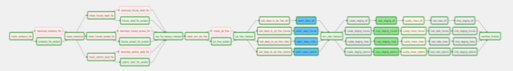

# AWS MWAA local runner

It's a tool provided by AWS, which can run MWAA locally for experimenting and developing.

## Instructions

Only the instructions of which can be provided unfortunately.

1. Have WSL, Docker and a linux distro installed, check [`this`](https://docs.microsoft.com/en-us/windows/wsl/install) and [`this`](https://www.docker.com/products/docker-desktop).
2. Run command prompt under linux distro by running command like `ubuntu` in command prompt if the linux distro installed is Ubuntu.
3. Clone the repository.
4. Run command `./mwaa-local-env build-image` and `./mwaa-local-env start` to start the server.  
5. Login Airflow UI on http://localhost:8080/ with default user:
    + Username: `admin`
    + Password: `test`

## The DAG

  

and [the origin resolution](../assets/dag_origin.png)


## Notice

+ The system shutdown and reboot will corrupt all connection setting, which should be deleted and re-created every time.

+ Data filled in the field `extra` of connections should be in proper json format, could be tested with [`json.loads`](https://docs.python.org/3/library/json.html#json.loads) of module [`json`](https://docs.python.org/3/library/json.html) in python.

+ When deploying to MWAA, the `plugins.zip` shouldn't contains a redundant layer of folder. i.g. `plugins(.zip)/plugins/contents`

+ The `.sql` files under `/dags` can be moved anywhere else, however, the parameter `template_searchpath` of DAG should be set, which should be absolute path, and varies depend on environment. [`see`](https://www.astronomer.io/guides/airflow-sql-tutorial/).

+ The jinja template won't rendered recursively, do not put templated variable inside template, be extra careful when using `params` to template sql commands. Also noticed that the parameter name should be `params`, not `parameter` as the document shows. 

+ The connection variables below are used in the project, which shown the form of `dict` in python is only for convenience, and should be added in Airflow UI.


``` python
{
    Conn_id: 'aws_default',  
    Conn_type: 'Amazon Web Services',  
    Login: '<AWS_ACCESS_KEY_ID>',   
    Password: '<AWS_SECRET_ACCESS_KEY>',  
    Extra: '{ "region_name" : "us-east-1" }'  
}
```  

``` python
{
    Conn_id: 'emr_default',
    Conn_type: 'Elastic MapReduce',
    Extra: """
{
    "Name": "indextracker",
    "ReleaseLabel": "emr-6.5.0",
    "LogUri": "s3://indextracker/emr/logs/",
    "Instances": {
        "InstanceGroups": [
            {
                "Name": "Master nodes",
                "Market": "ON_DEMAND",
                "InstanceRole": "MASTER",
                "InstanceType": "m5.xlarge",
                "InstanceCount": 1
            },
            {
                "Name": "Slave nodes",
                "Market": "ON_DEMAND",
                "InstanceRole": "CORE",
                "InstanceType": "m5.xlarge",
                "InstanceCount": 2
            }
        ],
        "TerminationProtected": false,
        "KeepJobFlowAliveWhenNoSteps": false
    },
    
    "ServiceRole": "EMR_DefaultRole",
    "JobFlowRole": "EMR_EC2_DefaultRole",

    "Applications": [
        {
            "Name": "Spark"
        }
    ],

    "Tags": [
        {
            "Key": "for-use-with-amazon-emr-managed-policies",
            "Value": "true"
        }
    ]
}
    """
}
```  

``` python
{
    Conn_id: 'postgres_default',
    Conn_type: 'Postgres',
    Host: '<REDSHIFT_ENDPOINT>',
    Schema: 'dev',
    Login: '<REDSHIFT_USERNAME>',
    Password: '<REDSHIFT_PASSWORD>',
    Port: 5439, 
}
```